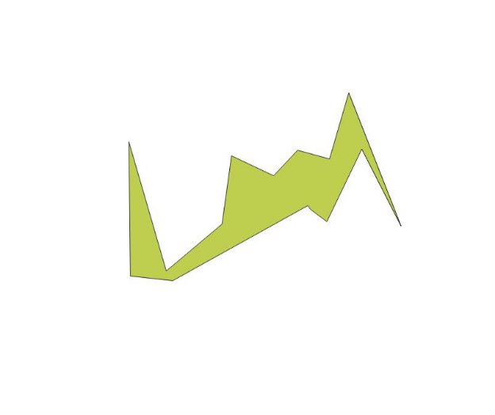
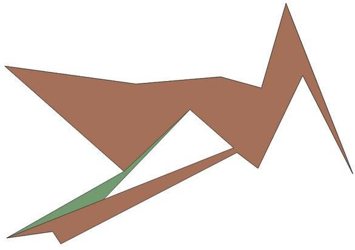
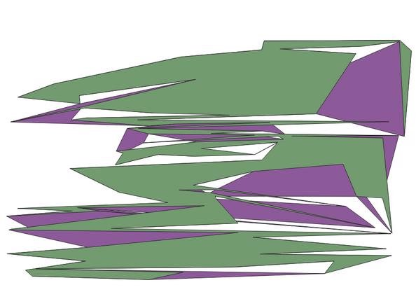
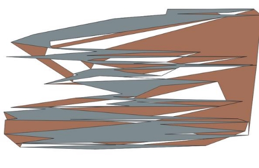
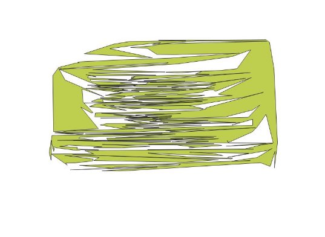
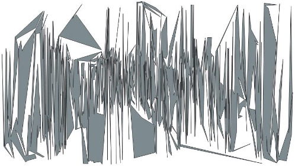

# Polygon Generation

Περιεχόμενα  
[Περιγραφή](#a-περιγραφή) 
[Δομή Κώδικα](#β-δομή-κώδικα) 
[Μεταγλώττιση](#γ-μεταγλώττιση) 
[Οδηγίες Χρήσης](#δ-οδηγίες-χρήσης) 
[Φοιτήτες](#ε-φοιτητές) 
[Incremental](#incremental) 
[Convex Hull](#convex-hull) 
[Onion](#onion) 

## A. Περιγραφή

    Το πρόγραμμα υπολογίζει ένα απλό κλειστό πολύγωνο το οποίο διέρχεται από όλα τα σημεία ενός δοσμένου συνόλου. Αξιοποιεί τρεις αλγορίθμους με διάφορες παραμέτρους για τον κάθε ένα. Υπολογίζει το εμβαδόν του τελικού πολυγώνου και με την χρήση του αλγορίθμου Pick, ο οποίος έχει υλοποιηθεί εξ αρχής. Παράγει ένα αρχείο εξόδου με αποτελέσματα σχετικά με το παραγόμενο πολύγωνο. 

 

## Β. Δομή Κώδικα
<ul>
<li>
<b>main.cpp</b> 
Στο αρχείο αυτό αξιοποιούνται όλα τα άλλα και έχει γραφεί η main συνάρτηση. Εδώ γίνεται ο έλεγχος των ορισμάτων, το διάβασμα τις εισόδου, η διαχείριση της παραμετρικής λειτουργίας του προγράμματος και η παραγωγή του/των αρχείου/αρχείων εξόδου.  
</li>
<li>
<b>shared.h</b> 
    Τα κοινά header αρχεία που γίνονται include από τα αρχεία υλοποίησης των αλγορίθμων, κοινός ορισμός typedef για ομοιότητα στον κώδικα και ορισμός structs και enums για την να είναι πιο ευανάγνωστος ο κώδικας στην main συνάρτηση.
</li>
<li>
<b>PolygonGenerator.h</b> 
    Ορισμός abstract κλάσης που περιγράφει την γενική λειτουργία ενός αλγόριθμου που παίρνει σημειοσύνολο ως είσοδο και παράγει ένα απλό πολύγωνο που διέρχεται από όλα τα σημεία. Κάθε κλάση που υλοποιεί έναν αλγόριθμο, είναι υποκλάση αυτής. 
</li>
<li>
<b>incr.h</b> 
    Ορισμός κλάσης που υλοποιεί τον αυξητικό αλγόριθμο (incremental).
</li>
<li>
<b>incr.cpp</b> 
    Υλοποίηση κλάσης που χρησιμοποιεί τον αυξητικό αλγόριθμο για την παραγωγή του ζητούμενου πολυγώνου.
</li>
<li>
<b>ConvexHullAlgo.h</b> 
    Ορισμός κλάσης που υλοποιεί τον αλγόριθμο convex hull.
</li>
<li>
<b>ConvexHullAlgo.cpp</b> 
    Υλοποίηση κλάσης που χρησιμοποιεί τον αλγόριθμο convex hull για την παραγωγή του ζητούμενου πολυγώνου.
</li>
<li>
<b>onion.h</b> 
    Ορισμός κλάσης που υλοποιεί τον αλγόριθμο onion και συναρτήσεων της.
</li>
<li>
<b>onion.cpp</b> 
    Υλοποίηση κλάσης που χρησιμοποιεί τον αλγόριθμο onion για την παραγωγή του ζητούμενου πολυγώνου.
</li>
<li>
<b>Pick.h</b> 
    Ορισμός της συνάρτησης που υπολογίζει το εμβαδόν ενός πολυγώνου βάσει του αλγόριθμου Pick
</li>
<li>
<b>Pick.cpp</b> 
    Υλοποίηση της συνάρτης που υπολογίζει το εμβαδόν ενός πολυγώνου βάσει του αλγόριθμου Pick
</li>
<li>
<b>pythonQgisScript.py</b> 
    Python script που αξιοποεί τα WKT αρχεία που παράγει το πρόγραμμα (αν δώσουμε το flag -show_shapes) για το λογισμικό QGIS. Για να αξιοποιηθεί χρειάζεται να έχουμε βάλει στο QGIS την επέκταση QuickWKT και να αλλάξουμε την τιμή της μεταβλητής exeDir στο full path του καταλόγου του εκτελέσιμου.
</li>
</ul>
 

## Γ. Μεταγλώττιση
Στον κατάλογο που βρίσκονται τα πηγαία αρχεία  
<code>
    cgal_create_CMakelists -s to_polygon  
    cmake -DCGAL_DIR = path-to-cgal-dir . 
    make  
</code>
όπου path-to-cgal-dir το path στον κατάλογο CGAL
 

## Δ. Οδηγίες Χρήσης
<code>
    ./to_polygon -i "input-file" -o "output-file" -algorithm "algorithm" [FLAGS]  
</code>
    όπου:  
    <ul>
    <li>"input-file" το αρχείο εισόδου με τα σημεία υπό την μορφή που περιγράφεται στην εκφώνηση</li>
    <li>"output-file" το αρχείο εξόδου που θέλουμε να παραχτεί. Περιέχει τα αποτελέσματα υπό την μορφή που περιγράφονται στην εκφώνηση</li>
    <li>"algorithm" μία από τις τιμές: incremental, convex_hull, onion για τον αντίστοιχο αλγόριθμο</li>
    <li>[FLAGS]: 
        Για να μην υπολογιστεί το εμβαδόν με τον αλγόριθμο Pick (επειδή παίρνει πολύ χρόνο): <code>-hide_pick</code> 
        Για να παραχτούν WKT αρχεία με το σημειοσύνολο (points.wkt), το κυρτό περίβλημα (hull.wkt) και το παραγόμενο πολύγωνο (polygon.wkt) στον κατάλογο του εκετελέσιμου: <code>-show_shapes</code>
        Για τον κάθε αλγόριθμο:  
        <ul>
            <li>Για τον incremental: 
                <code>-edge_selecetion</code>. Δυνατές τιμές: 
                1 για τυχαία επιλογή ακμής 
                2 για επιλογή ακμής με που προσθέτει το ελάχιστο εμβαδόν 
                3 για την επιλογή ακμής με που προσθέτει το μέγιστο εμβαδόν  
                <code>-initialization</code>. Δυνατές τιμές: 
                1a, 2a, 1b, 2b που προσφέρουν την λειτουργικότητα που περιγράφεται στην εκφώνηση
            </li>
            <li>Για τον convex_hull: 
                <code>-edge_selecetion</code>. Δυνατές τιμές: 
                1 για τυχαία επιλογή ακμής 
                2 για επιλογή ακμής με που προσθέτει το ελάχιστο εμβαδόν 
                3 για την επιλογή ακμής με που προσθέτει το μέγιστο εμβαδόν  
            </li>
            <li>Για τον onion: 
                <code>-onion_initialization</code>. Δυνατές τιμές: 
                1, 2, 3, 4, 5 που προσφέρουν την λειτουργικότητα που περιγράφεται στην εκφώνηση
            </li>
        </ul>
    </li>
    </ul>
    Παράδειγματα εκτέλεσης:  
    <code>./to_polygon -i ../instances/data/images/euro-night-0000020.instance -o test.txt -algorithm onion -onion_initialization 1</code> 
    <code>./to_polygon -i ../instances/data/images/euro-night-0000020.instance -o test.txt -algorithm incremental -edge_selection 1 -initialization 1a -show_shapes</code> 
    <code>./to_polygon -i ../instances/data/images/euro-night-0000020.instance -o test.txt -algorithm convex_hull -edge_selection 1 -hide_pick</code> 
    
 

## Ε. Φοιτητές

Λουκάς Μαστορόπουλος &nbsp; 1115 2017 00078  
Νικόλαος Χαρίσης &nbsp; 1115 2017 00187  
Θάνος Βάιος   &nbsp;  &nbsp;  1115 2018 00016  

## Incremental
Παρακατω θα δουμε τις διαφορες καθως και καποιες παρατηρησεις σχετικα με τα πολυγωνα που παραγει ο αλγοριθμος σε σχεση με τις τιμες αρχικοποιησης.

Αρχικα ας δουμε καποια μικρα παραδείγματα που οι διαφορες ειναι ορατες. Οσον αφορα την σειρα ταξινομησης των δεδομενων:

Για 15 σημεια ,με edge selection 2,αυτο ειναι το πολυγωνο εαν ταξινομησουμε σε φθηνουσα σειρα το y.

Και αυτο εαν ταξινομησουμε σε αυξουσα το χ.

Παρατηρουμε οτι ενω τα σημεια παραμενουν τα ιδια η σειρα και οι ακμες των πολυγωνων αλλαζουν αναλογα με την σειρα με την οποια δωσουμε τα δεδομενα.Αρα μπορουμε να φτιαξουμε τουλαχιστον 4 διαφορετικα πολυγωνα με τα ιδια 15 σημεια.

Οσον αφορα την επιλογη της ακμης,εχουμε 3 τροπους να γινει,τυχαια επιλογη απο την λιστα των ορατων,η ακμη που μεγιστοποιει ή ελαχιστοποιει το εμβαδον.Εδω θα παρατηρησουμε αρκετα μεγαλυτερη διαφορα στα πολυγωνα,ακομα και στα πολυγωνα με τα ιδια σημεια και την ιδια ταξινομηση.

Εδω μπορουμε να δουμε οτι με την ιδια εισοδο ,απο 2 διαδοχικες εκτελεσεις παιρνουμε διαφορετικα πολυγωνα.

Αυτο συμβαινει οταν δωσουμε σαν επιλογη την τυχαια ακμη.Αντιστοιχα περιμενουμε εκτελώντας στα ιδια σημεια τον αλγοριθμο αλλα με διαφορετικη επιλογη οσον αφορα το εμβαδον να εχουμε παρομοια αποτελεσματα.

Ενα ακομη παραδειγμα,απλα με περισσοτερα σημεια:

Πραγματι  μπορουμε να δουμε οτι με τα ιδια σημεια και την ιδια ταξινομηση το γρι πολυγωνο(ελαχιστο εμβαδον) εχει αρκετα μικροτερη περιφερεια σε σχεση με το καφε πολυγωνο(μεγιστο εμβαδον).

Τελος μπορουμε να δουμε τα αποτελεσματα του αλγοριθμου για αρκετα περισσοτερα σημεια για να ειμαστε σιγουροι οτι τρεχει και για μεγαλυτερο ογκο δεδομενων.

-500 σημεια:

-1000 σημεια:

## Convex Hull

Δομές: 
<ul>
<li><b>PointPairList</b>: Λίστα με ζεύγη σημείων. Αναπαριστά τις αντιστοιχίσεις ακμών του τρέχοντος πολυγώνου και εσωτερικών του σημείων. Το πρώτο σημείο του ζεύγους είναι η source κορυφή της ακμής, και το δεύτερο το εσωτερικό σημείο.</li>
<li><b>PointPairListIterator</b>: Iterator για την παραπάνω δομή</li>
</ul>

Κύρια Λειτουργία: 
<ul>
<li><b>generatePolygon</b>: Δημιουργούμε το αρχικό πολύγωνο ως το κυρτό περίβλημα με την βοήθεια της συνάρτησης που προσφέρει η cgal. Ορίζουμε ως την λίστα σημείων <b>uninserted</b> το σύνολο σημείων που ήταν στην είσοδο αλλά δεν είναι στο κυρτό περίβλημα (δηλαδή στο αρχικό πολύγωνο) και την υπολογίζουμε ως την διαφορά των δύο με την συνάρτηση set_difference. Αρχικοποιούμε την γενήτρια τυχαίων αριθμών για την περίπτωση που θέλουμε να επιλέγουμε τυχαία ζεύγος ακμής και σημείου για επέκταση της πολυγωνικής γραμμής. Μέχρι να αδειάσει το σύνολο των uninserted σημείων: βρίσκουμε το κοντινότερο εσωτερικό σημείο για κάθε ακμή του τρέχοντος πολυγώνου, κάνουμε επιλογή ζεύγους ακμής και σημείου με βάση το flag που έδωσε ο χρήστης, ενημερώνουμε το πολύγωνο, ενημερώνουμε τη λίστα uninserted.</li>
</ul>

Λοιπές Συναρτήσεις: 
<ul>
<li><b>isReplaceable</b>: ελέγχει αν το σπάσιμο μίας ακμής (initialEdge) ΑΒ και η ένωση των άκρων της με ένα σημείο Γ (p), τέμνει το πολύγωνο (poly) σε κάποιο σημείο. Επιστρέφει true αν ΔΕΝ το τέμνει, αλλιώς false. Δημιουργούμε τις ακμές ΑΓ και ΓΒ. Για κάθε ακμή του πολυγώνου ελέγχουμε αν τέμνεται από τις ακμές που δημιουργήσαμε σε κάποιο σημείο εκτός των Α και Β (γιατί αν τέμνει εκεί δεν είναι πρόβλημα).</li>
<li><b>closestReplaceables</b>: Επιστρέφει το κοντινότερο σημείο σε μία ακμή (segment) (αν υπάρχει) το οποίο είναι εσωτερικό του πολυγώνου (polygon) τα οποία βρίσκονται σε μία λίστα (list), την οποία την έχουμε είναι η uninserted, για την οποία επιστρέφει true η isReplaceable(point, segment, polygon), δηλαδή θα ήταν έγκυρη η αντικατάσταση. Βρίσκουμε το πρώτο σημείο που ικανοποιεί την isReplaceable, και κρατάμε την απόσταση του από την ακμή. Για κάθε ένα από τα υπόλοιπα εσωτερικά ψάχνουμε πιο είναι το κοντινότερο που ικανοποιεί την isReplaceable. Χρήση της δομής optional της βιβλιοθήκης boost.</li>
<li><b>AllClosestReplaceable</b>: αποθηκεύει για κάθε ακμή του πολυγώνου (poly) το κοντινότερο εσωτερικό σημείο (list) στην δομή record. Αδειάζει την record, για κάθε ακμή καλεί την isReplaceable και βάζουμε το αποτέλεσμα (αν υπάρχει) στην δομή</li>
<li><b>selectEdge</b>: για κάθε τιμή του flag -edge_selection επιλέγουμε ένα συνδιασμό ακμής - σημείου. Στην εκφώνηση λέει 2 για την προσθήκη ελάχιστου εμβαδού, και 3 για την προσθήκη μέγιστου εμβαδού. Επειδή στον αλγόριθμο convex_hull δεν προστίθεται εμβαδόν αλλά αφαιρείται, για τιμή 2 (min) επιλέγουμε τον συνδιασμό ποπυ αφαιρεί το μικρότερο εμβαδόν και για τιμή 3 αυτόν που αφαιρεί το μέγιστο εμβαδόν. Για να ξέρουμε πόσο εμβαδόν αφαιρείται, υπολογίζουμε το εμβαδόν του τριγώνου που ορίζεται από την ακμή και το σημείο. Τόσο είναι και το εμβαδόν που αφαιρείται. για να το κάνουμε αυτό όμως, επειδή στη δομή PointPairList κρατάμε μόνο τη source κορυφή της ακμής, δημιουργούμε αν χρειάζεται στην αρχή μία παράλληλη PointPairList που την λέμε edges, στην οποία για κάθε δείκτη στην record (PointPairList που φυλάμε ζεύγη source ακμής και εσωτερικού σημείου) το περιεχόμενο του ίδιου δείκτη (αναφερόμαστε στην απόσταση από την αρχή - begin()) είναι το ζεύγος των κορυφών της ακμής. Δηλαδή αν ΑΒ η ακμή και Γ το σημειο, record[iter][0] = edges[iter][0] = A, edges[iter][1] = B και record[iter][1] = Γ</li>
<li><b>updatePolygon</b>: ενημερώνει το πολύγωνο (polygon) με βάση την επιλογή (selection) συνδιασμού ακμής - σημείου που κάναμε. Απλά βάζει με την insert το σημείο μετά την source κορυφή της ακμής</li>
<li><b>updateUninserted</b>: ενημερώνει το σύνολο των εσωτερικών σημείων (uninserted) με βάση την επιλογή (selection) ακμής - σημείου που κάναμε. Απλά διαγράφει με την remove το σημείο που επιλέξαμε</li>
<li><b>printList</b>: βοηθητική συνάρτηση, εκτυπώνει το περιεχόμενο ενός vector, με ένα προεραιτικό μύνημα στην αρχή.</li>
</ul>

Σημειώσεις / Σχεδιαστικές Επιλογές: 
<ul>
<li>Όταν παίρνουμε το εμβαδόν για την επιλογή ακμής, παίρνουμε την απόλυτη τιμή του αποτελέσματος της συνάρτης area, γιατί δίνει και αρνητικές τιμές, ανάλογα με τον προσανατολισμό των σημείων.</li>
</ul>

Αποτελέσματα Εκτελέσεων και Σχολιασμός: 
<ul>
<li>
    Καθώς αυξάνουμε το μέγεθος της εισόδου παρατηρούμε ότι αυξάνεται πολύ ο χρόνος που χρειάζεται για να υπολογίσουμε το πολύγωνο. Η συμπεριφορά αυτή του αλγορίθμου είναι αναμενόμενη, καθώς αξιοποιεί πολλές επαναλήψεις (loops) εμφωλευμένες η μία στην άλλη. 
    <ul>
        <li>
            <b>Εντολή</b>: <code>./to_polygon -i ../instances/data/images/euro-night-0000015.instance -o test.txt -algorithm convex_hull -edge_selection 1 -hide_pick</code> 
            <b>Χρόνος</b>: 10 ms 
            <b>Αναλογία Εμβαδού</b>: 2.50149 
        </li>
        <li>
            <b>Εντολή</b>:<code>./to_polygon -i ../instances/data/images/euro-night-0000050.instance -o test.txt -algorithm convex_hull -edge_selection 1 -hide_pick</code> 
            <b>Χρόνος</b>: 613 ms 
            <b>Αναλογία Εμβαδού</b>: 2.01719 
        </li>
        <li>
            <b>Εντολή</b>:<code>./to_polygon -i ../instances/data/images/euro-night-0000100.instance -o test.txt -algorithm convex_hull -edge_selection 1 -hide_pick</code> 
            <b>Χρόνος</b>: 6858 ms 
            <b>Αναλογία Εμβαδού</b>: 1.71557 
        </li>
    </ul>
</li>
<li>
    Για διαφορετικές τιμές της παραμέτρου edge_selection παρατηρούμε ότι με (τιμή παραμέτρου 2) επιλογή ακμής που αφαιρεί το ελάχιστο εμβαδόν έχουμε τελικό πολύγωνο με σχετικά μεγάλο εμβαδον, για επιλογή ακμής που αφαιρεί το μέγιστο εμβαδόν (τιμή παραμέτρου 3) έχουμε τελικό πολύγωνο με σχετικά μικρό εμβαδόν και τέλος με τυχαία επιλογή ακμής (τιμή παραμέτρου 1) έχουμε ένα ενδιάμεσο αποτέλσμα. Αυτό γίνεται γιατί αν αφαιρούμε κάθε φορά το ελάχιστο (ή μέγιστο) εμβαδόν στο τέλος θα έχουμε πολύγωνο με το μέγιστο (ή ελάχιστο) εμβαδόν που μας επιτρέπουν οι διαδοχικές επιλογές ακμής. 
    <ul>
        <li>
            <b>Εντολή</b>: <code>./to_polygon -i ../instances/data/images/euro-night-0000040.instance -o test.txt -algorithm convex_hull -edge_selection 2 -hide_pick -show_shapes</code> 
            <b>Αποτέλεσμα</b>:  <image src="./images/ch_en40_min.png" width="40%"></image>
        </li>
        <li>
            <b>Εντολή</b>: <code>./to_polygon -i ../instances/data/images/euro-night-0000040.instance -o test.txt -algorithm convex_hull -edge_selection 3 -hide_pick -show_shapes</code> 
            <b>Αποτέλεσμα</b>:  <image src="./images/ch_en40_max.png" width="40%"></image>
        </li>
        <li>
            <b>Εντολή</b>: <code>./to_polygon -i ../instances/data/images/euro-night-0000040.instance -o test.txt -algorithm convex_hull -edge_selection 1 -hide_pick -show_shapes</code> 
            <b>Αποτέλεσμα</b>:  <image src="./images/ch_en40_random.png" width="40%"></image>
        </li>
</li>
</ul>

 

## Onion
Δομές: 
<ul>
<li> Polygon_2 που αντιπροσωπευει τα κυρτά περιβλήμματα που δημιουργούνται καθώς και το τελικό πολύγωνο που επιστρέφεται. Από την CGAL</li>
<li>
 Point_2 που αντιπροσωπεύει τα σημεία του χώρου και τις ακμές των πολυγώνων. Από την CGAL
</li>
<li>
Segment_2 για την αναπαράσταση των ακμών ανάμεσα σε διάφορα σημεία. Από την CGAL
</li>
<li>
Vector που χρησιμοποιείται για την αποθήκευση των σημείων και των κυρτών περιβλημάτων. Από την STL
</li>
</ul>

Κύρια Λειτουργία: 
<ul>
Το onion.cpp υλοποιεί κατά βάση 2 πράγματα. Τον constructor της κλασης OnionAlgo και την συνάρτηση generatePolygon.
<li> <code> OnionAlgo </code>:    

 Ο Constructor αρχικά καλεί τον constructor της υπερκλασης PolygonGenerator με όρισμα το list. Στη συνέχεια αρχικοποιεί το πεδίο option με βάση ό,τι έχει δωθεί

</li>
<li><code> generatePolygon</code>:    

 Στην συνάρτηση αυτή είναι που γίνεται και όλη η δουλεία αφού υπολογίζει το ζητούμενο πολύγωνο με βάση των αλγόριθμο των επάλληλων ΚΠ. Αρχικά σώζει τα σημεία σε έναν vector. Έπειτα υπογίζει όλα τα ΚΠ (ο υπολογισμός του ΚΠ είναι verbatim από το user manual της CGAl σχετικά με τα ΚΠ). Για κάθε σημείο που ανήκει στο ΚΠ, το αφαιρει απο τον vector των σημείων και το βαζει σε ενα πολύγωνο, το οποίο στο τέλος μπαίνει και αυτό σε ένα vector πολυγώνων. Η παραπάνω διαδικασία επαναλαμβάνεται μέχρις ότου να μείνουν λιγότερα από 3 σημεία στον αρχικό vector.

Στη συνέχεια διατρέχουμε τον vector με τα πολύγωνα εφαρμόζοντας τον αλγόριθμο του κρεμμυδίου. Επιλέγουμε την m-οστή κορυφή(που αντιστοιχεί και στην m-οστη ακμή) και βρίσκουμε τη κοντινότερη κορυφή k στο ΚΠ βάθους i+1(στην πράξη κοιτάμε στο πολύγωνο που βρίσκεται στην θέση i+1 στον vector των πολυγώνων).Ελέγχουμε αν τα σημεία m και k είναι ορατά μεταξύ τους. Αν δεν είναι, πρέπει αναγκαστικά να επιλέξουμε άλλο m. Έπειτα, παίρνουμε τις κορυφές mPlus και λ που είναι γειτονικές στα m και λ αντίστοιχα και είναι ορατές μεταξύ τους. Αν δεν υπάρχουν τέτοιες κορυφές, πρέπει να βρούμε διαφορετικό m. Ελέγχουμε αν οι ακμες m-k και mPlus-λ τέμνονται μεταξύ τους. Αν ναι, τότε απλώς κάνουμε swap τις κορυφές m και m+1. Εν συνεχεία, σπάμε τις ακμές m-m+1 και k-λ
και ενώνουμε τα 2 πολύγωνα, μια διαδικασία που εξαρτάται από τις τιμές των m,mPlus,k και λ. Έπειτα, βρίσκουμε τα καινουργια m και m+1 κινούμενοι όπως περιγράφει ο αλγόριθμος, προσέχοντας μόνο να διαλέξουμε διαφορετικές κορυφές από τις αρχικές. Αντιστοιχούμε τις νέες κορυφές σε αυτές του "μεικτού" πολυγώνου και επαναλαμβάνουμε μέχρι να φτάσουμε στο τελικό βάθος

 Όταν φτάσουμε στο τελικό βάθος, διατρέχουμε το vector με τα αρχικά σημεία, ο οποίος πλέον περιέχει τα σημεία τα οποία δεν άνηκαν σε κάποιο ΚΠ κατα την κατασκευή των ΚΠ. Για να τα προσθέσουμε, βρίσκουμε τη κοντυνότερη κορυφή στο "μεικτό" πολύγωνο. Θα πρέπει τόσο αυτή, όσο και μία από τις γειτονικές της να είναι ορατές. Αν δεν είναι, τότε βρίσκουμε την 1η κορυφή του ΚΠ στο τελευταίο βάθος που είναι ορατή και πληροί της παραπάνω προϋποθέσεις ( ξέρουμε ότι σίγουρα θα ανήκει και στο "μεικτό" πολύγωνο, απλά πρέπει να κάνουμε την αντιστοιχία). 

 Τέλος, επιστρέφουμε το "μεικτό" πολύγωνο που δημιουργήθηκε από την παραπάνω διαδικασία

</li>
</ul>

Λοιπές Συναρτήσεις: 
<ul>

Πέρα από τις βασικές συναρτήσεις που περιγράφηκαν πιο πάνω στο onion.cpp είναι ορισμένες και κάποιοες βοηθητικές συναρτήσεις.

<li><code>isVisible</code>: 

Η συγκεκριμένη συνάρτηση χρησιμοποιείται για να αποφανθεί αν ένα 2 σημεία είναι ορατά μεταξύ τους. Πρακτικά, παίρνει σαν όρισμα το ευθύγραμμο τμήμα που σχηματίζουν τα 2 σημεία και ελέγχει αν τέμνει το πολύγωνο σε ακριβώς 2 σημεία (θεωρούμε πως το initialEdge[1] είναι κορυφή του πολυγώνου poly).

</li>
<li><code>pointInPolygon</code>: 

Ελέγχει αν ένα σημείο βρίσκεται πάνω στη περιφέρεια του πολυγώνου, με το να τσεκάρει αν είναι συνευθειακό με κάποιο ζεύγος γειτονικών κορυφών του πολυγώνου

</li>
<li><code>getClosestK</code>: 
Επιστρέφει την κοντυνότερη κορυφή του πολυγώνου στο δωθέν σημείο. Η θέση του πολυγώνου επιστρέφεται στον indexClosestK

</li>
<li><code>getVertexIt</code>: 

Επιστρέφει τον Vertex_Iterator που αντιστοιχεί στην κορυφή

</li>
<li><code>nextIndex</code>: 

Επιστρέφει τον επόμενο δείκτη

</li>
<li><code>previousIndex</code>: 

Επιστρέφει τον προηγούμενο δείκτη

</li>
</ul>

Σημειώσεις / Σχεδιαστικές Επιλογές: 
<ul>

 Κατά την υλοποιήση του αλγορίθμου εμφανίστηκε η ανάγκη για την λήψη μερικών σχεδιαστικών επιλογών/αποφάσεων. Αυτές είναι:

<li> Ένα σημείο μπορεί να ανήκει σε 1 μόνο πολύγωνο/ΚΠ. Έτσι, κατά την κατασκευή των επάλληλων ΚΠ αν ένα σημείο βρεθεί να ανήκει στο ΚΠ του προηγούμενου βάθους απλά αγνοείται
</li>
<li> Η CGAL εμφανίζει πρόβλημα στην διαχείρηση πολυγώνων που δεν είναι στην πραγματικότητα πολύγωνο (πχ ένα πολύγωνο με 2 μόνο κορυφές). Έτσι, σε περίπτωση που φτάσουμε στο τελευταίο βάθος να έχουμε 3 σημεία τα οποία είναι όμως συνευθειακά, 1 από αυτά (το 2ο) αγνοείται.
</li>
<li> Αν κατά την επιλογή του m, το κοντινότερο σημείο k δεν είναι ορατό, αντί να αλλάξει το k, προτιμάτε να αλλάξει το m. Το σκεπτικό πίσω από αυτή την απόφαση είναι ότι το k επιλέγεται εξ αρχής έτσι ώστε να είναι το κοντινότερο
</li>
<li> Αν το μέγεθος του ΚΠ σε κάποιο βάθος είναι περιττός αριθμός, υπάρχει περίπτωση κατά την αντίρροπη κίνηση τους τα k και λ να συναντηθούν στην ίδια κορυφή.Αν συμβεί αυτό, τότε το λ προχωράει 1 βήμα παραπάνω με το k να το "περιμένει"
</li>
<li>Για την εισαγωγή των σημείων που έμειναν εκτός των ΚΠ, ψάχνουμε πρώτα για το κοντινότερο σημειο στο μεικτό πολύγωνο και σε περίπτωση που δεν πληροι τις προϋποθεσεις, ψάχνουμε στο τελευταιο ΚΠ. Αυτό γίνεται για να έχουμε μια παρόμοια φιλοσοφία με τον αλγόριθμο.
</li>
<li> Για την υλοποίηση της τυχαιότητας στην επιλογή της κορυφής χρησιμοποιήθηκε η συνάρτηση <code>rand()</code> αρχικοποιημένη με seed <code>time(0)</code>
</li>
</ul>

Αποτελέσματα Εκτελέσεων και Σχολιασμός: 
<ul>
Τα αποτελέσματα κάποιων ενδεικτικών εκτελέσεων υπάρχουν αναλυτικότερα στον φάκελο docs/ στο αντίστοιχο pdf.
Ένας πρόχειρος σχολιασμός αυτών είναι ο εξής:

 <li>

Σχετικά με τον χρόνο, ο αλγόριθμος αυτό τρέχει γρήγορα για εύλογο αριθμό σημείων. Φαίνεται να είναι πιο γρήγορος απο τους 2 προηγούμενους, χωρίς παρόλα αυτά να επιστρέφει καλύτρετα αποτελέσματα.

 Τα πολύγωνα που δημιουργούναι πληρούν τις προϋποθέσεις και περιλαμβάνουν όλα τα σημεία. Παρόλα αυτά, δεν είναι ιδιαίτερα σίγουρο πως το εμδαδόν που επιστρέφεται είναι το βέλτιστο. Στα πιο μεγάλα dataset, φαίνεται να υπάρχει μια τάση να επιστραφονται σχετικά μικρά εμβαδά, με λεπτά και μακρόστενα τρίγωνα.

Γενικά, αν υπάρχει κάτι άξιο σχολιασμού, αυτό είναι η επιλογή της αρχικής κορυφής m, η οποία σίγουρα παίζει. Στα πιο αραια σημειοσύνολα η επιλογή αυτή έχει ξεκάθαρη επίπτωση στο εμβαδόν των πολυγώνων που δημιουργούνται, με κάποια πολύγωνα να ξεχωρίζουν. Παρόλα αυτά, όσο πυκώνουν τα dataset τόσο μικρότερη φαίνεται να είναι η επίδρασή της. Σίγουρα υπάρχουν διαφοροποιήσεις, αλλά είναι πιο μικρές. Πάντως, η εμπειρία κατά την υλοποιήση, την αποσφαλμάτωση και τον έλεγχο του ζητουμένου έδειξε πως μια αρκετά καλή επιλογή για m είναι η μεσαία κορυφή του 1ου ΚΠ.

</li>
</ul>
 